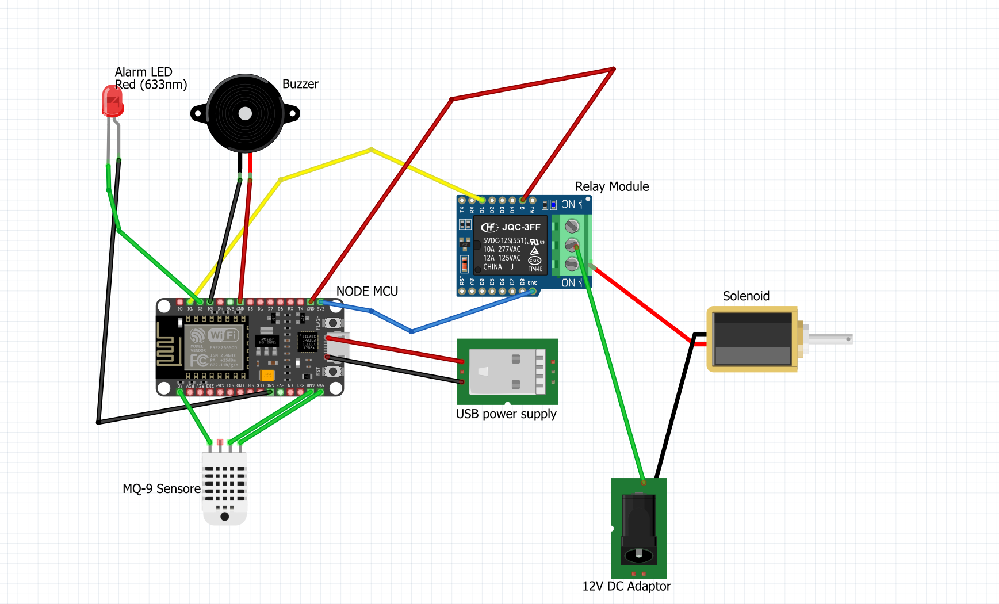
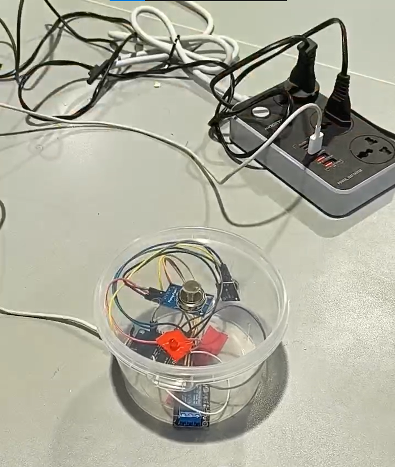

# Gas Leak Detector (NodeMCU + MQ-9)

A gas leak detector built around a NodeMCU (ESP8266) and an MQ-9 sensor. When the sensor reading goes above a threshold, the board closes a solenoid gas valve through a relay and starts a buzzer and an alarm LED. The board also hosts a small web panel where you can change the thresholds, override the relay by hand and mute the buzzer.

## How it works

The MQ-9 analog output is read once per second on `A0`. If the value is above the active threshold:

- the relay is switched on, which powers the solenoid valve and closes it
- the buzzer beeps and the red LED turns on
- the panel shows a gas alarm

When the reading drops back below the threshold the relay switches off again, unless relay lock is enabled (see below).

The board runs its own Wi-Fi access point, so the panel works without a router. It can optionally join a home network as well.

## Parts

| Part | Notes |
|------|-------|
| NodeMCU v3 (ESP8266) | |
| MQ-9 gas sensor module | the module with an analog `AO` pin |
| 1-channel 5 V relay module | I used a JQC-3FF relay shield |
| 12 V solenoid gas valve | normally open, closes when energised (see notes) |
| 12 V DC adapter | powers the valve |
| Active buzzer | |
| Red LED + 220 ohm resistor | |
| 5 V USB supply | powers the NodeMCU |

## Wiring

| From | To |
|------|----|
| MQ-9 `AO` | NodeMCU `A0` |
| MQ-9 `VCC` / `GND` | NodeMCU `Vin` (5 V) / `GND` |
| Relay `IN` | NodeMCU `D1` |
| Relay power / `GND` | NodeMCU `3V3` / `GND` (as in the diagram) |
| Buzzer `+` / `-` | NodeMCU `D3` / `GND` |
| LED anode (through 220 ohm) / cathode | NodeMCU `D2` / `GND` |
| 12 V adapter `+` | relay `COM` |
| Relay `NO` | valve `+` |
| Valve `-` | 12 V adapter `-` |

The 12 V side only goes through the relay contacts. The NodeMCU and the valve supply share nothing except the relay.

Pin numbers can be changed at the top of the sketch.

## Setup

1. Install the Arduino IDE and add the ESP8266 board package.
2. Install the **ArduinoJson** library, version 6.x (the sketch uses the v6 API).
3. Put `gas_leak_detector.ino` in a folder called `gas_leak_detector` (the Arduino IDE requires the folder and sketch names to match).
4. Optional: at the top of the sketch, change `AP_PASSWORD`, and set `HOME_SSID` / `HOME_PASSWORD` if you want the board to join your Wi-Fi as well.
5. Select the board **NodeMCU 1.0 (ESP-12E Module)** and upload.

Don't commit your real Wi-Fi credentials.

## Using the panel

Connect to the `Gas Detector` access point and open `http://192.168.1.1` (most phones open it automatically as a captive portal). If you set `HOME_SSID`, the board's address on your network is printed on the serial monitor (115200 baud).

- **Automatic mode** is the default. The relay follows the sensor.
- **Manual mode** starts when you switch the relay by hand from the panel. Automatic control is paused for a duration you choose (5 to 180 seconds) or until you press "Back to auto". The alarm and buzzer still follow the sensor while in manual mode.
- **Relay lock**: when enabled, a relay that was tripped by gas stays on until you turn it off manually, even after the reading has returned to normal.
- **Thresholds** can be a single general value or three separate ones for CO, gas and smoke. Values are raw ADC readings (0-1023); the default is 400 and the allowed range is 30-1000.
- **Buzzer** can be muted or tested from the panel.
- **Reset settings** restores all defaults.

## HTTP API

| Method | Path | Purpose |
|--------|------|---------|
| GET | `/` | web panel |
| GET | `/data` | live sensor and status values |
| GET | `/settings` | current thresholds and options |
| GET | `/sensorinfo` | short status summary |
| GET | `/buzzer?action=mute\|unmute\|test` | buzzer control |
| POST | `/control` | `{"device":"relay","action":"on\|off\|toggle"}` |
| POST | `/set-timer` | `{"timeout": ms}`, 5000-180000, or 0 for permanent |
| POST | `/return-to-auto` | leave manual mode |
| POST | `/toggle-relay-lock` | enable or disable relay lock |
| POST | `/set-threshold` | `{"threshold": n}` |
| POST | `/set-gas-threshold` | `{"gasType":"CO\|GAS\|SMOKE","threshold": n}` |
| POST | `/toggle-threshold-mode` | `{"useGeneral": true\|false}` |
| POST | `/reset-settings` | restore defaults |

## Notes and limitations

- **This is a hobby / learning project, not a certified safety device.** Don't rely on it as the only protection in a real installation.
- **The valve is energised to close.** If the board or the valve supply loses power, the valve stays open. A normally-closed valve that is energised to open would fail safe, but the relay logic would need to be inverted.
- **The MQ-9 needs warming up.** Readings are high and unstable for the first minutes after power-up, and the datasheet recommends a long burn-in (around 48 hours) before first use. Expect false alarms until then.
- **Readings are not calibrated.** The sensor is not selective, so the CO / gas / smoke cards on the panel all show the same reading on different labels. In per-gas mode the lowest of the three thresholds is what trips the alarm.
- **ADC voltage.** `A0` accepts at most 3.3 V. If the MQ-9 module is powered from 5 V, its `AO` output can go higher, so use a voltage divider.
- **Solenoid.** Put a flyback diode across the valve coil to protect the relay contacts.
- **Relay supply.** Most relay modules want 5 V for the coil. If yours doesn't switch reliably on `3V3`, feed it from `Vin`.
- Settings are kept in RAM only and go back to defaults after a reboot.
- The panel loads its icons from a CDN, so they only show up if the phone has internet access (for example through the home network).
- The panel has no login. Access is limited only by the access point password.

## License

MIT
